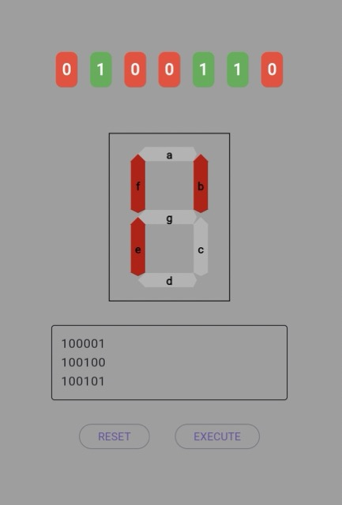

# Seven Segment Display

A small app to practice "programming" a seven segment one digit display via binary commands.

## Preview



## Segment Encoding

- Segment `a`: 00001
- Segment `b`: 00010
- Segment `c`: 00011
- Segment `d`: 00100
- Segment `e`: 00101
- Segment `f`: 00110
- Segment `g`: 00111
- All segments: 11111

## Command Structure

Each command consists of 6 bits:

- The first bit (0 or 1) determines whether to deactivate (0) or activate (1) the segment.
- The next 5 bits specify which segment to target using the encoding above.

## Command Examples

1. **Activate segment `a`**: `100001`
   - 1 (activate) + 00000 (segment a)
2. **Deactivate segment `d`**: `000100`
   - 0 (deactivate) + 00011 (segment d)
3. **Activate segment `g`**: `100111`
   - 1 (activate) + 00110 (segment g)

## Full Example Program

To activate segments `a`, `b`, `c`, and `d` and then deactivate them:

### Turn on segments `a`, `b`, `c`, and `d`:

- Activate `a`: `100001`
- Activate `b`: `100010`
- Activate `c`: `100011`
- Activate `d`: `100100`

### Turn off segments `a`, `b`, `c`, and `d`:

- Deactivate `a`: `000001`
- Deactivate `b`: `000010`
- Deactivate `c`: `000011`
- Deactivate `d`: `000100`

## Full Binary Program

```bash
100001
100010
100011
100100
000001
000010
000011
000100
```

## Turning all segments on / off:

- Turn all on: `111111`
- Turn all off: `011111`

## Possible characters


