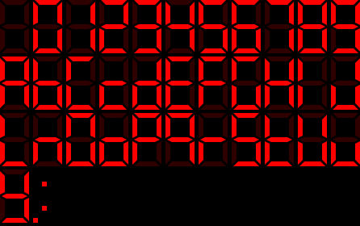
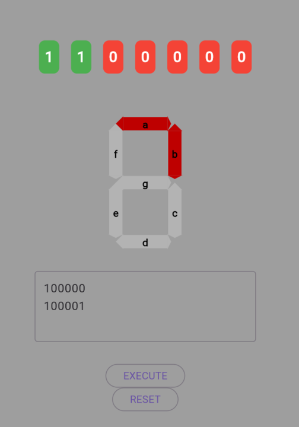

Certainly! Below is the encoding for the segments using characters instead of numbers. Each segment will be represented by a character from 'a' to 'g'.

### Segment Encoding

- Segment `a`: 00000
- Segment `b`: 00001
- Segment `c`: 00010
- Segment `d`: 00011
- Segment `e`: 00100
- Segment `f`: 00101
- Segment `g`: 00110

### Command Structure

Each command consists of 6 bits:
- The first bit (0 or 1) determines whether to deactivate (0) or activate (1) the segment.
- The next 5 bits specify which segment to target using the encoding above.

### Command Examples

1. **Activate segment `a`**: `100000`
   - 1 (activate) + 00000 (segment a)
2. **Deactivate segment `d`**: `000011`
   - 0 (deactivate) + 00011 (segment d)
3. **Activate segment `g`**: `100110`
   - 1 (activate) + 00110 (segment g)

### Full Example Program

To activate segments `a`, `b`, `c`, and `d` and then deactivate them:

#### Turn on segments `a`, `b`, `c`, and `d`:
- Activate `a`: `100000`
- Activate `b`: `100001`
- Activate `c`: `100010`
- Activate `d`: `100011`

#### Turn off segments `a`, `b`, `c`, and `d`:
- Deactivate `a`: `000000`
- Deactivate `b`: `000001`
- Deactivate `c`: `000010`
- Deactivate `d`: `000011`

### Full Binary Program
100000 100001 100010 100011 000000 000001 000010 000011

This encoding and structure will allow you to control a 7-segment display using binary commands with characters representing each segment.

### Possible examples

### Preview

